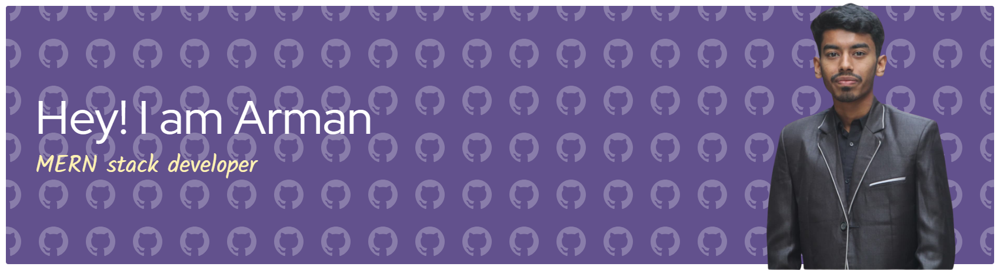
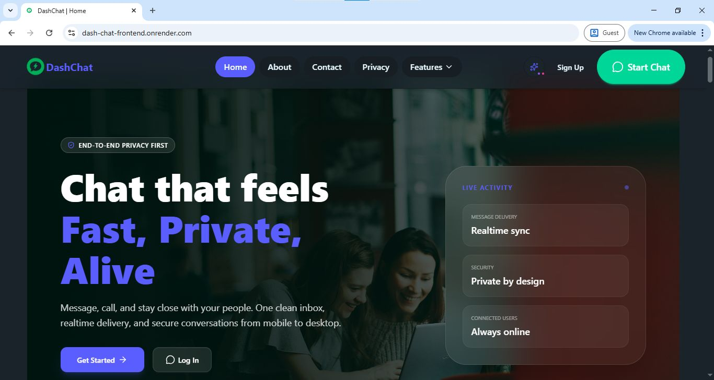
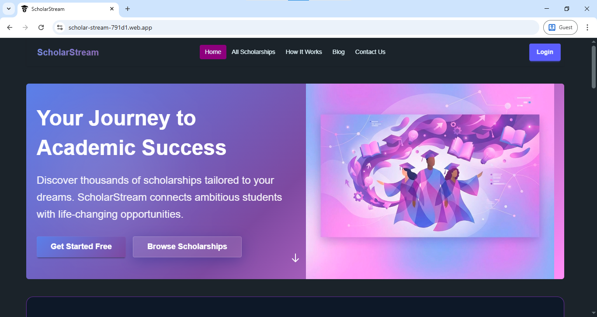

    
  

  

###

  <h1 align="center">Hi! 👋 I'm Arman Islam</h1>
  

 
###

 
  
  
   
  

  

 
  

   

###

###

<h3 align="left">👩‍💻  About Me</h3>

###

 I from Bangladesh.I am currently living and working in Malaysia.   -✨ Right now, I'm diving into the world of web development, expanding my skills and knowledge to create amazing digital experiences.  - 🖥️ I’m currently working on **React.js, Next.js, React, ExpressJs** for frontend development.  
  - 📫 Feel free to reach me out on <a href="mailto:armanislam988@gmail.com">Email</a> 

###
<b> FOLLOW ME ON SOCIALS:</b>

  

    
    
    
  

###

##  <b> TECHNOLOGY STACK:</b>

### Languages:

### CSS Frameworks & Libraries:

### JavaScript Frameworks & Libraries:

### Database:

### Deployment Platform:

### Tools & Technologies:

###  🚀 PROJECTS:

<table width="100%">
  <tr>
    <td width="45%">
      
    </td>
    <td width="55%" valign="top">
      <h3>DashChat - Real-time Messaging</h3>
      
A high-performance chat application built for seamless communication. Features include real-time messaging, user status, and secure authentication.

      
<b>🛠️ Tech Stack:</b> MongoDB, Express.js, React, Node.js, Socket.io

      

        
        
      

    </td>
  </tr>
  <tr>
    <td width="45%">
      
    </td>
    <td width="55%" valign="top">
      <h3>Scholarship Management System</h3>
      
A robust platform designed to streamline scholarship applications. Users can browse, save, and track their applications through an intuitive dashboard.

      
<b>🛠️ Tech Stack:</b> Next.js, Firebase, Tailwind CSS, Node.js

      

        
        
      

    </td>
  </tr>
</table>

###
### <h3 align="left">🔥   My Stats :</h3>

###

